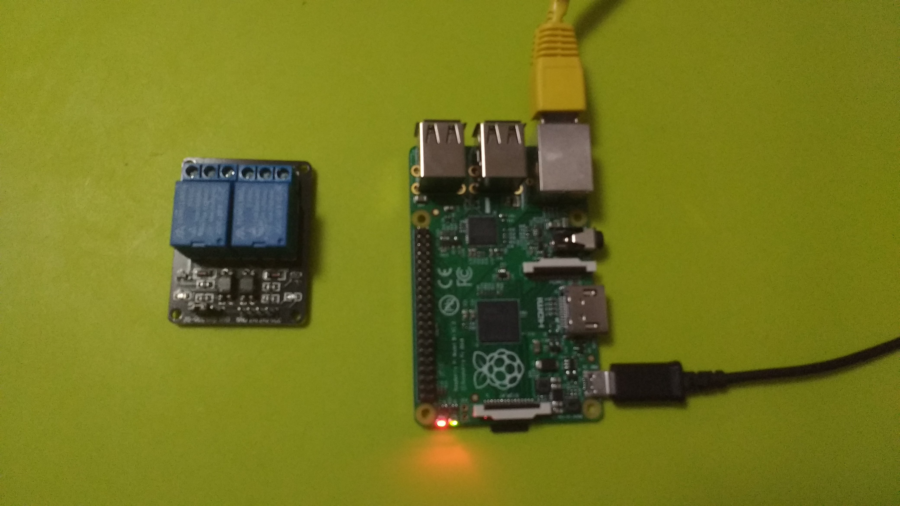

The gateway uses a Raspberry Pi with Eclipse Kura to run the application that controls the relay board, Eclipse Leshan to communicate with the sensor, and Eclipse Paho to communicate with the server. The sources of the project are available on GitHub: https://github.com/brusdev/smart-solar-heating-system/tree/master/gateway



## Eclipse Leshan
Eclipse Leshan is an OMA Lightweight M2M (LWM2M) implementation in Java. Leshan relies on the Eclipse Californium project for the CoAP and DTLS implementation and provides libraries which help people to develop their own Lightweight M2M server and client.
The project also provides a client, a server and a bootstrap server demonstration as an example of the Leshan API and for testing purpose.
To init the LWM2M server you have to set the local address, to load the models and register a listener.

```Java
// Prepare LWM2M server
LeshanServerBuilder builder = new LeshanServerBuilder();
builder.setLocalAddress(null, coap_port);
builder.setEncoder(new DefaultLwM2mNodeEncoder());
builder.setDecoder(new DefaultLwM2mNodeDecoder());
builder.setCoapConfig(LeshanServerBuilder.createDefaultNetworkConfig());

// Define model provider
List<ObjectModel> models = ObjectLoader.loadDefault();
models.addAll(ObjectLoader.loadDdfResources("/models/", new String[] { "3300.xml" }));
LwM2mModelProvider modelProvider = new StaticModelProvider(models);
builder.setObjectModelProvider(modelProvider);

// Create and start LWM2M server
logger.info("Build LeshanServer");
lwServer = builder.build();

// Add a listener
lwServer.getRegistrationService().addListener(...);

//Start the server
try {
  logger.info("Start LeshanServer");
  lwServer.start();
} catch (Exception e) {
  logger.error("Exception starting LeshanServer: " + e);
  
  logger.info("Stop LeshanServer");
  lwServer.stop();
}
```

## Eclipse Paho
Eclipse Paho is a set of scalable open-source implementations of open and standard messaging protocols aimed at new, existing, and emerging applications for Machine-to-Machine (M2M) and Internet of Things (IoT). To init the MQTT client you need to set the broker, the username and the password.

```Java
mqttClient = new MqttClient(mqttBroker, mqttClientId, new MemoryPersistence());
mqttConnectOptions = new MqttConnectOptions();
mqttConnectOptions.setCleanSession(true);
mqttConnectOptions.setUserName(mqttUsername);
mqttConnectOptions.setPassword(mqttPassword.toCharArray());
```

## Eclipse Kura
Eclipse Kura offers a platform that can live at the boundary between the private device network and the local network, public Internet or cellular network providing a manageable and intelligent gateway for that boundary capable of running applications that can harvest locally gathered information and deliver it reliably to the cloud.
Eclipse Kura can be installed on a Raspberry Pi but it requires Raspbian, gdebi and OpenJDK. You can find the detailed instrucions on [Raspberry Pi Quick Start](https://eclipse.github.io/kura/intro/raspberry-pi-quick-start.html).
The Kura development environment may be installed on a Windows, Linux, or Mac OS. The setup instructions will be the same across OSs though each system may have unique characteristics. Eclipse Kura Development Environment consists of the following components: JVM (Java JDK SE 8 or Open JDK 8), Eclipse IDE, Kura Workspace. You can find the detailed instrucions on [Getting Started](https://eclipse.github.io/kura/dev/kura-setup.html).

The GPIOService may be used to access the gpio pins that control the relay board adding a reference to GPIOService int the component definition.

```Xml
<?xml version="1.0" encoding="UTF-8"?>
<scr:component xmlns:scr="http://www.osgi.org/xmlns/scr/v1.1.0" activate="activate" deactivate="deactivate" name="eu.bruscino.dev.sshs.gateway">
   <implementation class="eu.bruscino.dev.sshs.gateway.Executor"/>
   <reference bind="bindGPIOService" cardinality="1..n" interface="org.eclipse.kura.gpio.GPIOService" name="GPIOService" policy="dynamic" unbind="unbindGPIOService"/>
</scr:component>
```

The kura deployment package can be created with the Eclipse IDE (following the instructions on [Hello World Example](https://eclipse.github.io/kura/dev/hello-example.html)) or with maven:
* Download the Kura User Workspace from [Eclipse Kura download page](https://www.eclipse.org/kura/downloads.php).
* Unzip the Kura User Workspace `unzip ~/Downloads/user_workspace_archive_4.1.0.zip -d ~/Downloads/user_workspace_archive_4.1.0`
* Execute the maven command `mvn clean package`