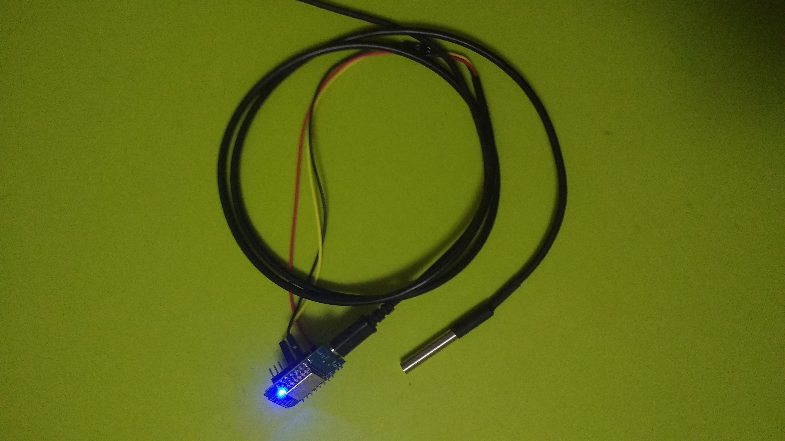

The sensor uses an ESP8266 board with the protocol Lightweight M2M to communicate the temperature read by DS18B20 to the gateway. The sources of the project are available on GitHub: https://github.com/brusdev/smart-solar-heating-system/tree/master/sensor



## ESP8266
The ESP8266 is a low-cost Wi-Fi microchip with full TCP/IP stack and microcontroller capability produced by Espressif Systems. The avalability of same SDK allows the chip to be programmed, removing the need for a separate microcontroller. To program the microchip i use the SDK Arduino core for ESP8266 WiFi chip and PlatformIO, that is an open source ecosystem for IoT development.

## LwM2M
Lightweight M2M is a protocol from the Open Mobile Alliance for M2M or IoT device management and communication. It uses CoAP, a light and compact protocol with an efficient resource data model, for the application layer communication between LWM2M Servers and LWM2M Clients.
Each service on a constrained device/sensor/actor is modelled as an LWM2M object instance. An object has a unique identifier and may have instances. Some LWM2M object identifiers are standardised via the OMA Object & Resource Registry (http://technical.openmobilealliance.org/Technical/technical-information/omna/lightweight-m2m-lwm2m-object-registry).

libWakaamaEmb
I use libWakaamaEmb by David Gräff,  to enable LwM2M on the ESP8266, with a little change to fix the connection to a server without a bootstrap server. You can find the changes at following repository: https://github.com/brusdev/libWakaamaEmb/tree/patch-esp8266.
The library libWakaamaEmb is published to the PlatformIO library registry and Arduino library registry and available on Github. I use the PlatformIO and copy the library direcory under my project "lib" folder but i need to select lwip version 2. PlatformIO doesn't allow to select lwip version 2 so i need to change manually the file .platformio/packages/framework-arduinoespressif8266/tools/platformio-build.py replacing lwip with lwip2.
To expose the temperature i implement the object 3300 that rapresents a generic sensor.

```C
 /*
 * Implements a generic sensor
 *
 *                 Multiple
 * Object |  ID  | Instances | Mandatoty |
 *  Sensor| 3300 |    Yes    |    No     |
 *
 *  Ressources:
 *              Supported    Multiple
 *  Name | ID | Operations | Instances | Mandatory |  Type   | Range | Units |      Description      |
 *  value|5700|    R       |    No     |    Yes    |  Float  |       |       |  Sensor Value         |
 *  unit |5701|    R       |    No     |    Yes    | String  |       |       |  Sensor Units         |
 *  minv |5601|    R       |    No     |    Yes    |  Float  |       |       |  Min Measured Value   |
 *  maxv |5602|    R       |    No     |    Yes    |  Float  |       |       |  Max Measured Value   |
 *  minr |5603|    R       |    No     |    Yes    |  Float  |       |       |  Min Range Value      |
 *  maxr |5604|    R       |    No     |    Yes    |  Float  |       |       |  Max Range Value      |
 *  appt |5750|    R/W     |    No     |    Yes    | String  |       |       |  Application Type     |
 *  type |5751|    R       |    No     |    Yes    | String  |       |       |  Sensor Type          |
 *  reset|5605|    E       |    No     |    Yes    | Opaque  |       |       |  Reset Min and Max    |
 *
 */
 ```

To connect a server witouth the bootstrap server i need to add manually the server address:

```C
#define LWM2M_SERVER_ADDR "coap://192.168.10.16"
lwm2m_add_server(123, LWM2M_SERVER_ADDR, 100, false, NULL, NULL, 0);
```

## DS18B20
The DS18B20 digital thermometer provides 9-bit to 12-bit Celsius temperature measurements and has an alarm function with nonvolatile user-programmable upper and lower trigger points. The DS18B20 communicates over a 1-Wire bus that by definition requires only one data line (and ground) for communication with a central microprocessor. In addition, the DS18B20 can derive power directly from the data line ("parasite power"), eliminating the need for an external power supply.
I use the DallasTemperature library of arduino to read the temperature by DS18B20.

```C
#include <DallasTemperature.h>

OneWire oneWire(ONE_WIRE_BUS);
DallasTemperature DS18B20(&oneWire);

DS18B20.begin();

numberOfDevices = DS18B20.getDeviceCount();
Serial.print( "Device count: " );
Serial.println( numberOfDevices );

lastTemp = millis();
DS18B20.requestTemperatures();

// Loop through each device, print out address
for(int i=0;i<numberOfDevices; i++){
  // Search the wire for address
  if( DS18B20.getAddress(devAddr[i], i) ){
    //devAddr[i] = tempDeviceAddress;
    Serial.print("Found device ");
    Serial.print(i, DEC);
    Serial.print(" with address: " + GetAddressToString(devAddr[i]));
    Serial.println();
  }else{
    Serial.print("Found ghost device at ");
    Serial.print(i, DEC);
    Serial.print(" but could not detect address. Check power and cabling");
  }

  //Get resolution of DS18b20
  Serial.print("Resolution: ");
  Serial.print(DS18B20.getResolution( devAddr[i] ));
  Serial.println();

  //Read temperature from DS18b20
  float tempC = DS18B20.getTempC( devAddr[i]);
  Serial.print("Temp C: ");
  Serial.println(tempC);
}
```
